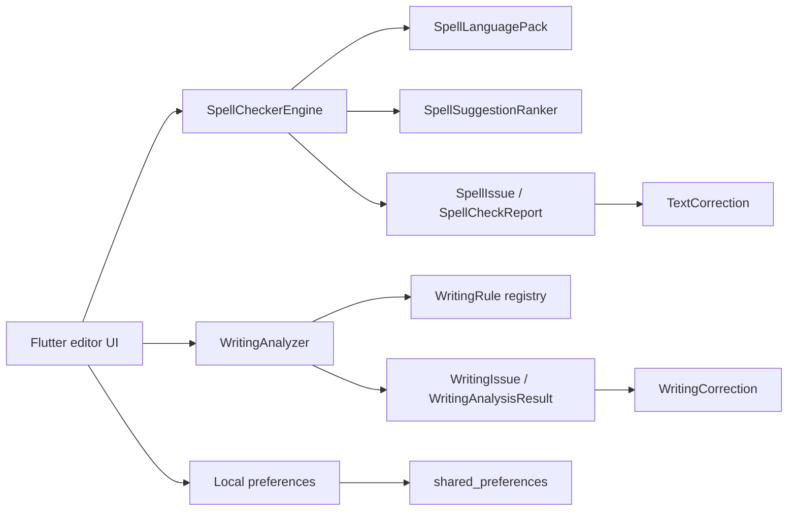

# SpellChecker

[](https://github.com/sanskarIN/SpellChecker/actions/workflows/ci.yml)
[](LICENSE)
[](https://buymeacoffee.com/sanskarIN)

SpellChecker is a privacy-first, open-source Flutter spelling utility and deterministic writing assistant. It checks text locally, highlights spelling issues inside the editor, ranks correction suggestions, supports explicit English language packs, keeps personal vocabulary and writing-rule choices local, offers keyboard-first review, applies source-range-safe corrections, and exposes reusable Dart APIs.

**Current package:** `2.16.0+21`  
**Built-in languages:** English (US) `en-US`, English (UK) `en-GB`  
**Built-in writing rules:** 10  
**Runtime dependencies:** Flutter SDK and `shared_preferences`  
**Committed/release-built target:** Flutter web

<p align="center">
  <a href="https://buymeacoffee.com/sanskarIN">
    
  </a>
</p>

## Why SpellChecker

- **Local by design.** The bundled application does not send editor text to a remote spelling/grammar service and does not add accounts, telemetry, cloud writing, or document upload.
- **Deterministic corrections.** Spelling and writing fixes verify current source ranges before mutation, and batch writing fixes use a deterministic conservative overlap policy.
- **Unicode-aware.** Tokenization supports Unicode letters/combining marks, edit distance works over Unicode scalar values, and source offsets stay compatible with Dart/Flutter UTF-16 text editing.
- **Language explicit.** Built-in `en-US` and `en-GB` packs keep regional dictionaries, personal vocabulary, and writing-rule choices separate.
- **Explainable writing review.** Ten built-in local rules cover repeated words, capitalization, spacing, punctuation, trailing whitespace, repeated punctuation, and advisory unmatched delimiters.
- **Large-document aware.** The bundled UI captures the first 200 spelling issues and first 200 writing findings with explicit limited-result semantics; writing analysis can still report exact totals.
- **Reusable.** Public Dart barrels expose spelling, language-pack, correction, suggestion-ranking, writing-rule, diagnostics, and transfer-codec APIs.
- **Tested.** CI runs canonical formatting, `flutter analyze`, the complete Flutter test suite, and deterministic benchmark smoke.

## Complete documentation

The authoritative documentation hub is **[docs/README.md](docs/README.md)**.

| Need | Start here |
| --- | --- |
| Install/run the project | [Getting started](docs/GETTING_STARTED.md) |
| Use the application | [User guide](docs/USER_GUIDE.md) |
| See every current capability/limit | [Feature reference](docs/FEATURES.md) |
| Understand settings, dictionaries, and transfer formats | [Configuration and local data](docs/CONFIGURATION.md) |
| Learn shortcuts | [Keyboard shortcuts](docs/KEYBOARD_SHORTCUTS.md) |
| Get common answers | [FAQ](docs/FAQ.md) |
| Look up terminology | [Glossary](docs/GLOSSARY.md) |
| Copy public API examples | [Library examples](docs/EXAMPLES.md) |
| Integrate the Dart API | [Public API](docs/API.md) |
| Extend languages | [Language packs](docs/LANGUAGE_PACKS.md) |
| Extend writing analysis | [Writing rules](docs/WRITING_RULES.md) |
| Understand internals | [Architecture](docs/ARCHITECTURE.md) |
| Understand target/build support | [Platform support](docs/PLATFORM_SUPPORT.md) |
| Understand privacy | [Privacy](docs/PRIVACY.md) |
| Understand accessibility | [Accessibility](docs/ACCESSIBILITY.md) |
| Troubleshoot | [Troubleshooting](docs/TROUBLESHOOTING.md) |
| Contribute/develop | [Development](docs/DEVELOPMENT.md), [Testing](docs/TESTING.md), [Contributing](CONTRIBUTING.md) |
| Maintain documentation | [Documentation maintenance](docs/DOCUMENTATION_MAINTENANCE.md) |
| Release the project | [Releasing](docs/RELEASING.md) |
| Read historical design/audit records | [Release history](docs/RELEASE_HISTORY.md) and [CHANGELOG](CHANGELOG.md) |

## Quick start

Prerequisites: Git and Flutter stable with a Dart SDK compatible with `>=3.8.0 <4.0.0`.

```bash
git clone https://github.com/sanskarIN/SpellChecker.git
cd SpellChecker
flutter pub get
flutter run -d chrome
```

The repository commits the web host. Additional Android/iOS/Windows/macOS/Linux runners are not currently committed; see [Platform support](docs/PLATFORM_SUPPORT.md) before making cross-platform release claims.

## Application workflow

1. Enter or paste text in the editor.
2. Choose English (US) or English (UK).
3. Select **Check spelling** or press `Ctrl+Enter` / `Command+Enter`.
4. Review underlined issues and ranked suggestions.
5. Use `F7` / `Shift+F7` to move between spelling issues.
6. Open **Writing insights** or press `Ctrl+Shift+Enter` / `Command+Shift+Enter` for deterministic local writing review.
7. Save vocabulary to the selected language's personal dictionary, or use **Ignore once** for session-only acceptance.
8. Use **Portable settings** for non-document preference transfer and the dictionary manager for separate personal-vocabulary transfer.
9. Use **Undo correction** to reverse the latest correction/batch represented in the bounded in-memory correction history.

Manual typing invalidates the previous spelling snapshot so stale offsets are not reused for corrections.

## Current writing rules

| ID | Purpose | Automatic fix |
| --- | --- | --- |
| `repeated-word` | consecutive repeated word | yes |
| `sentence-capitalization` | lowercase sentence start | yes |
| `repeated-space` | repeated interior spaces | yes |
| `punctuation-spacing` | whitespace before common punctuation | yes |
| `missing-punctuation-space` | missing space after selected punctuation between words | yes |
| `trailing-whitespace` | trailing spaces/tabs | yes |
| `repeated-punctuation` | repeated identical punctuation | yes |
| `unmatched-parenthesis` | unpaired literal parenthesis | advisory |
| `unmatched-square-bracket` | unpaired literal square bracket | advisory |
| `unmatched-curly-brace` | unpaired literal curly brace | advisory |

All current built-ins support language code `en`, making both registered English packs eligible. Structural unmatched-delimiter rules deliberately do not guess whether insertion, deletion, movement, or rewriting is the correct correction.

See [Writing rules](docs/WRITING_RULES.md) for source ownership, severities, categories, bounded analysis, preferences, safe batch correction, diagnostics, and custom-rule guidance.

## Keyboard shortcuts

| Action | Shortcut |
| --- | --- |
| Check spelling | `Ctrl+Enter` / `Command+Enter` |
| Open Writing insights | `Ctrl+Shift+Enter` / `Command+Shift+Enter` |
| Next spelling issue | `F7` |
| Previous spelling issue | `Shift+F7` |
| Focus Writing insights search | `Ctrl+F` / `Command+F` |
| Clear active review query / close Writing insights | `Escape` |

Inside Writing insights, Escape first clears active transient search/category/automatic-fix filters. When the review query is already empty, Escape closes the dialog.

## Public Dart API

Core spelling:

```dart
import 'package:spellchecker/spell_checker.dart';

final engine = SpellCheckerEngine();
final issues = engine.check('Helo world');

for (final issue in issues) {
  print('${issue.word}: ${issue.suggestions}');
}
```

Bounded spelling analysis:

```dart
final report = engine.analyze(
  text,
  suggestionLimit: 5,
  maxIssues: 200,
);

print(report.capturedIssueCount);
print(report.truncated);
```

Writing analysis:

```dart
import 'package:spellchecker/language.dart';
import 'package:spellchecker/writing.dart';

final analyzer = WritingAnalyzer();
final result = analyzer.analyze(
  'hello  world!!',
  languagePack: SpellLanguageRegistry.englishUs,
  maxIssues: 200,
);

for (final issue in result.issues) {
  print('${issue.ruleId}: ${issue.message}');
}
```

See [Library examples](docs/EXAMPLES.md) and [Public API](docs/API.md) for complete usage.

## Personal dictionary versus Portable settings

These are intentionally different transfer paths.

**Personal dictionary export/import** carries normalized language-specific vocabulary. Current language-aware exports use dictionary format version 2 and include the language ID; supported legacy forms remain readable.

**Portable settings** uses format `spellchecker-settings`, version 1, and carries only:

- selected language;
- suggestion limit;
- explicit per-language writing-rule overrides.

Portable settings deliberately excludes editor text, personal vocabulary, ignored session words, findings, source excerpts, correction history, and transient Writing insights filters/presets.

See [Configuration](docs/CONFIGURATION.md) for exact JSON examples and validation rules.

## Privacy model

SpellChecker's bundled analysis is local. The application does not require:

- a network spelling or grammar API;
- a generative rewrite model;
- user accounts;
- analytics/telemetry for editor analysis;
- document upload;
- cloud preference or dictionary synchronization.

Durable application preferences use `shared_preferences`. Editor text, current findings, ignored words, and correction history are not stored as durable preferences by SpellChecker.

Explicit clipboard actions can copy personal-dictionary export JSON, Portable settings JSON, or a metadata-only writing diagnostic summary. They occur only after the user invokes the relevant control.

Read [Privacy](docs/PRIVACY.md) and [Security](SECURITY.md) for the full boundaries.

## Architecture at a glance



The reusable spelling/language/writing layers do not depend on Flutter widgets. See [Architecture](docs/ARCHITECTURE.md) for package boundaries and data flow.

## Development quality gates

Resolve dependencies first:

```bash
flutter pub get
```

Then run:

```bash
dart format --output=none --set-exit-if-changed lib test tool
flutter analyze
flutter test --reporter expanded
```

CI also runs the deterministic benchmark CLI smoke scenario. The release workflow repeats the gates, then runs:

```bash
flutter build web --release
```

and uploads `build/web` as the release workflow artifact.

See [Testing](docs/TESTING.md), [Performance](docs/PERFORMANCE.md), and [Releasing](docs/RELEASING.md).

## Repository structure

```text
.github/       CI, release workflow, funding, issue/PR collaboration config
lib/core/      spelling, language, codecs, correction, statistics primitives
lib/data/      bundled language dictionary/frequency data
lib/writing/   deterministic writing-rule subsystem
lib/features/  Flutter editor/application workflow
lib/storage/   local application preference adapters
docs/          evergreen documentation + historical release/audit records
test/          unit, persistence, codec, Unicode, stress, accessibility, widget tests
tool/          deterministic benchmark tooling
web/           committed Flutter web host
```

## Version and historical records

The current package version is `2.16.0+21`. V2.16 is the final-stabilization release line in package metadata. A post-V2.16 repository audit on August 16, 2026 fixed additional sentence-statistics and sentence-capitalization edge cases without changing the package version.

Current behavior belongs in evergreen documentation. Release-specific files under `docs/V2_*` and dated audit records preserve historical design/validation context and can contain older registry sizes that were correct for those releases.

Use [Release history](docs/RELEASE_HISTORY.md), [CHANGELOG](CHANGELOG.md), and [Post-V2.16 audit](docs/POST_V216_AUDIT_2026_08_16.md) when historical context is needed.

## Contributing

Contributions are welcome. Before submitting a change, read:

- [CONTRIBUTING.md](CONTRIBUTING.md)
- [Development guide](docs/DEVELOPMENT.md)
- [Testing guide](docs/TESTING.md)
- [Documentation maintenance](docs/DOCUMENTATION_MAINTENANCE.md)
- [Code of Conduct](CODE_OF_CONDUCT.md)

Public API, writing-rule, language-pack, persistence, platform, privacy, accessibility, and release changes should update the matching evergreen documentation in the same pull request.

## Support and security

For normal help and bug-report preparation, read [SUPPORT.md](SUPPORT.md) and [Troubleshooting](docs/TROUBLESHOOTING.md). Use minimal synthetic reproductions instead of private documents when possible.

For security vulnerabilities, follow [SECURITY.md](SECURITY.md) and prefer private reporting rather than a public issue.

## License

SpellChecker is licensed under the [MIT License](LICENSE).

## Optional funding

SpellChecker is free and open source. Funding never determines whether a bug, security report, contribution, or feature request can be submitted or reviewed.

If you want to support continued development, use **[Buy Me a Coffee](https://buymeacoffee.com/sanskarIN)**.
