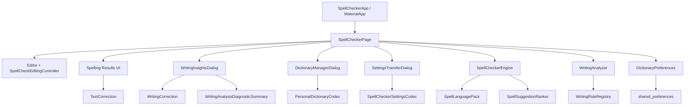
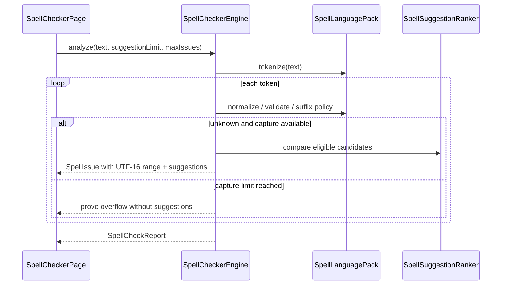

# Architecture

This page describes the current SpellChecker `2.16.0+21` architecture: reusable Dart layers, Flutter application workflow, local persistence, analysis/correction lifecycle, and important trust/data boundaries.

## System overview



## Design principles

The architecture prioritizes:

- local deterministic analysis;
- separation of reusable logic from Flutter widgets;
- explicit language ownership;
- immutable result metadata;
- exact source-range ownership;
- stale-safe correction;
- bounded UI/result retention for large inputs;
- per-language local preferences;
- versioned transfer formats;
- testability without network/services;
- conservative behavior when mutation is ambiguous.

## Top-level public libraries

```text
lib/spell_checker.dart   core spelling/correction/codec/statistics public barrel
lib/language.dart        language-pack public barrel
lib/writing.dart         writing-analysis public barrel
```

These barrels define the supported reusable API surface. Flutter UI and storage adapters are not public just because they live under `lib/`.

## Application layer

### `lib/main.dart`

Application process entry point. It launches the Flutter application.

### `lib/app.dart`

Defines `SpellCheckerApp`, Material 3 theming, system light/dark behavior, and `SpellCheckerPage` as the home surface.

### `lib/features/editor/spell_checker_page.dart`

The main integration/controller surface. It owns editor/application state such as:

- current text editing controller/focus;
- selected language;
- active `SpellCheckerEngine`;
- personal/ignored word state reflected by the engine;
- suggestion limit;
- current spelling result/report;
- active spelling issue index;
- per-language writing-rule choices;
- correction undo stack;
- preference loading/storage-availability state;
- dialog invocation/results.

The page orchestrates reusable layers; it does not implement dictionary distance algorithms or individual writing rules.

### `SpellCheckEditingController`

Owns presentation of inline checked spelling ranges while preserving Flutter composing-range visibility. Issue styling is derived from the latest current spelling snapshot.

### Dialogs

`DictionaryManagerDialog` manages personal vocabulary and suggestion count.

`WritingInsightsDialog` performs current text writing analysis, local review query/presets, rule switches, finding display, safe-fix requests, and diagnostic-summary copying.

`SettingsTransferDialog` displays/copies Portable settings and validates imported settings JSON before returning a settings document to the page.

## Core spelling layer

### `SpellLanguagePack`

Language-specific boundary around:

- stable ID/metadata;
- base dictionary;
- frequency ranks;
- tokenization;
- personal-word validation;
- normalization;
- recognized suffixes;
- suggestion source/distance policy.

### `SpellCheckerEngine`

Stateful reusable spelling service. It owns:

- selected pack;
- immutable base dictionary/frequencies;
- personal dictionary set;
- ignored-word set;
- suggestion cache;
- suggestion ranker.

It does not persist state. The Flutter/storage layer restores persisted vocabulary into a newly created engine.

### Spelling analysis lifecycle



The bundled page uses a 200-issue capture limit. The public engine can be unbounded or caller-bounded.

### Suggestion pipeline

For an unknown normalized target:

1. split recognized suffix where applicable;
2. use scalar length to determine maximum suggestion distance;
3. iterate base and personal candidates;
4. skip inappropriate candidate forms in the current engine implementation;
5. skip scalar length differences beyond the maximum;
6. calculate unrestricted scalar Damerau-Levenshtein distance;
7. create candidate metadata;
8. sort through `SpellSuggestionRanker`;
9. apply final lexical fallback;
10. reattach recognized suffix;
11. cache detailed result by normalized unknown word.

Personal-dictionary mutation clears the cache because candidate membership changes.

## Unicode coordinate architecture

SpellChecker intentionally separates **source coordinates** from **algorithmic scalar iteration**.

Source ranges use UTF-16 code-unit offsets, matching Dart string slicing and Flutter editing.

Scalar-sensitive algorithms use `String.runes`, including unrestricted edit distance and selected length/casing behavior. This prevents non-BMP characters from being split by single-code-unit logic while preserving interoperable source offsets.

## Core correction layer

### `TextCorrection`

Pure spelling mutation helpers. They accept text plus already-produced `SpellIssue` objects and refuse stale ranges.

`replaceOne` validates exact current source ownership before replacing.

`replaceAll` filters to represented matching current issues, sorts from source end to start, and applies case-adjusted replacements.

The helper returns text/caret/count metadata; the application decides how to store undo history and refresh analysis.

## Writing layer

### `WritingRule`

Plugin abstraction defining stable ID, metadata, language support, category, and deterministic `analyze(text, pack)` findings.

### `WritingRuleRegistry`

Owns the current ten built-in rule objects and default-enabled ID set.

### `WritingAnalyzer`

Coordinates:

- configured-rule validation;
- language support filtering;
- enabled-ID filtering;
- rule execution;
- exact overall/per-rule counting;
- deterministic global ordering;
- optional bounded retained prefix.

The analyzer is independent from Flutter widgets and persistence.

### Writing bounded analysis

A bounded analyzer cannot simply stop after N yielded findings because rule execution order and source order are different dimensions. A later rule can produce an earlier source position.

The bounded collector therefore keeps the globally best/earliest N findings according to the same comparator used for complete results and can displace a worse retained finding.

All enabled/supported rules still run so exact totals remain known.

### `WritingCorrection`

Pure safe mutation layer. Individual correction validates current source ownership and non-null replacement.

Batch correction sorts candidates by start/end/rule ID, accepts deterministic non-overlapping current automatic fixes, skips later overlaps/advisory/stale ranges, then mutates accepted ranges from end to start.

### Review layer

`WritingReviewQuery` and `WritingReviewPreset` are reusable pure review/filter metadata. The Flutter dialog keeps current search/category/fix-only state transient.

Rule enablement is not review-filter state; it is durable per-language configuration managed by the application.

### Diagnostic summary

`WritingAnalysisDiagnosticSummary` converts result/rule metadata into a deterministic support-friendly projection. It intentionally does not read/serialize editor text excerpts, finding messages, replacements, or source offsets.

## Persistence layer

### `DictionaryPreferences`

Application-internal adapter around `shared_preferences`.

Durable categories:

```text
selected language
suggestion limit
personal vocabulary per language
explicit enabled writing-rule IDs per language
```

Non-durable categories:

```text
editor text
spelling/writing findings
ignored session words
active issue index
review search/filter/preset state
correction history
```

### Writing-rule three-state model

Persistence distinguishes:

```text
missing key          -> use current registry defaults
non-empty stored set -> explicit enabled IDs
empty stored set     -> explicit disable-all
```

Resetting defaults removes the key instead of persisting a snapshot of current defaults.

### Storage failure model

Write/remove operations are considered durable only when `shared_preferences` reports success. Failures are surfaced to the UI rather than silently accepted.

The application can retain session behavior where appropriate, but messages must distinguish active in-memory state from durable saved state.

## Startup preference lifecycle

Startup preference loading is asynchronous.

At a high level:

1. page starts with built-in defaults/session state;
2. storage loads selected language and global suggestion count;
3. storage loads selected language's personal vocabulary and writing-rule override;
4. a language-specific engine is constructed/restored;
5. dependent current results are refreshed when appropriate;
6. loading state ends;
7. storage failures are reported and session-mode behavior remains available where safe.

Controls that require durable settings should not pretend persistence is ready while loading is incomplete.

## Language switch lifecycle

When the selected language changes:

1. load that language's saved personal dictionary;
2. load that language's explicit writing-rule override/unset state;
3. build a fresh `SpellCheckerEngine` for the pack;
4. restore personal words into it;
5. clear ignored/session/correction/stale issue state;
6. recheck current non-blank text.

This isolates personal vocabulary and writing-rule preferences by language.

## Transfer codecs

### Personal dictionary

`PersonalDictionaryCodec` owns versioned language-aware vocabulary serialization independent from preference storage.

Current UI export: version 2 with language ID. Legacy V1/array/plain formats remain readable.

### Portable settings

`SpellCheckerSettingsCodec` owns version 1 of `spellchecker-settings` and intentionally serializes only selected language, suggestion limit, and explicit per-language writing-rule overrides.

The two formats remain separate to make vocabulary inclusion an explicit user action rather than an accidental side effect of preference transfer.

## Portable settings import lifecycle

At application integration level:

1. decode/validate document;
2. obtain target language's already-persisted personal vocabulary separately;
3. apply imported durable preferences as a transaction with restoration attempts on failure;
4. rebuild selected language engine using existing target-language personal vocabulary;
5. set suggestion limit/effective writing rules;
6. clear stale issue/session/correction state;
7. recheck non-blank text.

Personal vocabulary is not overwritten by settings import.

## Correction undo architecture

The editor keeps a bounded stack of pre-correction `TextEditingValue` snapshots (current depth: 20).

Spelling single fix, spelling replace-all, writing single fix, and writing batch integrate through the same correction-history concept. A batch accepted as one mutation produces one undo entry.

Manual text editing can begin a new correction-history path; the stack is not document persistence/version control.

## Large-document UI policy

The application uses separate bounds:

```text
spelling issues: 200 captured
writing findings: 200 captured
```

Spelling overflow proof avoids unnecessary suggestion generation after the cap.

Writing analysis still computes exact totals because every enabled/supported rule scans the input; the capture bound controls retained findings/review scope.

## Privacy/trust boundary

Core spelling/writing layers do not make network calls. The application does not need a remote model/service for analysis.

External/system boundaries are limited to expected Flutter/project integration such as:

- local `shared_preferences`;
- explicit clipboard operations;
- host Flutter/browser rendering/storage behavior;
- GitHub/project links outside analysis.

See [Privacy](PRIVACY.md) and [Security](../SECURITY.md).

## Platform boundary

Only the web host is committed and release-built. Portable application logic is written in Flutter, but native runner/build/signing behavior is outside the current repository release contract.

See [Platform support](PLATFORM_SUPPORT.md).

## Test architecture

Tests intentionally mirror layer ownership:

- core unit tests for pure algorithms/models;
- codec tests for strict formats;
- persistence tests with mocked preferences;
- writing-rule/analyzer/correction tests;
- Unicode/source-range regressions;
- stress tests;
- Flutter widget/semantics/keyboard tests;
- benchmark tool/command tests;
- repository metadata/documentation tests.

See [Testing](TESTING.md).

## Dependency direction

Preferred dependency direction:

```text
UI -> storage integration
UI -> core spelling
UI -> writing
writing -> core language pack
core -> bundled data
```

Reusable core/writing logic must not import feature widgets. Storage is an application integration layer, not a requirement for core engine use.

## Extension points

Supported reusable extension points include:

- custom `SpellLanguagePack` passed to engine/analyzer;
- custom dictionary/frequency data for `SpellCheckerEngine`;
- custom deterministic `SpellSuggestionRanker`;
- custom `WritingRule` list for `WritingAnalyzer`.

These do not automatically extend the bundled application's registry/dropdowns/persistence formats. First-class bundled integration requires source changes and tests/docs.

## Related documentation

- [Public API](API.md)
- [Feature reference](FEATURES.md)
- [Development](DEVELOPMENT.md)
- [Testing](TESTING.md)
- [Language packs](LANGUAGE_PACKS.md)
- [Writing rules](WRITING_RULES.md)
- [Configuration](CONFIGURATION.md)
- [Privacy](PRIVACY.md)
